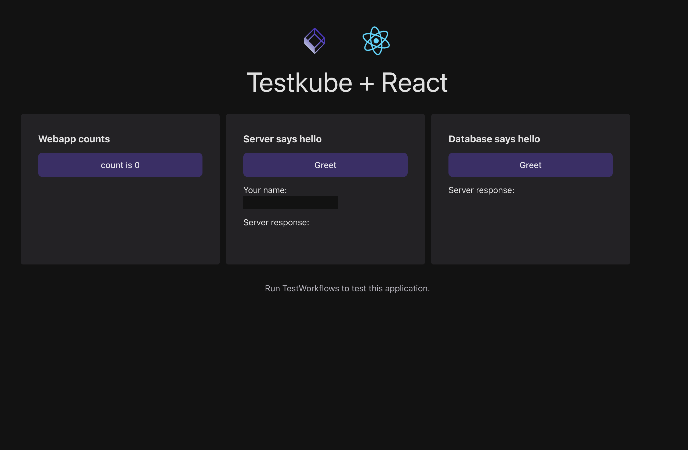

# Testkube Sample Application

A sample 3-tier application to run tests on.
The application is composed of a React frontend, NodeJs backend and a PostgreSQL database.

It can be used to showcase Testkube tests workflows.



## Kubernetes developer platform

Start with the [platform design and critical analysis](PLATFORM-DESIGN.md),
or its [shareable PDF](PLATFORM-DESIGN.pdf),
then follow the [developer guide and demo runbook](DEVELOPER-GUIDE.md).
See [validation evidence](VALIDATION.md) for what has actually been tested.

Install the platform CLI once (Python 3.10+, Git and pipx required):

```sh
make setup
make platform-version
```

`make setup` installs or replaces the CLI using the tag in `platform.lock.json` and runs `pipx ensurepath`. Make targets work immediately, without reopening the terminal. Standalone CLI commands may need a new shell. The pinned platform tag must be published first.

With the CLI, Docker, kind, kubectl and Helm 4.3 installed:

```sh
make platform-fetch
make platform-version
make up
make open
```

Open http://localhost:4173. Keep port 8080 available for the API tunnel.
The platform preserves the application files and Dockerfiles from `main`;
the browser requires localhost API access; the API now accepts environment-specific database credentials. The shared Helm chart and runtime are owned by [platform-tools](https://github.com/taskovskig/platform-tools).
The original files in `apps/api/k8s/` are retained as historical examples only.

The shared application chart has separate `api` and `web` releases. PostgreSQL
is a separate `db` release using a pinned upstream chart. Values live in `deploy/`.
Use `make deploy SERVICE=api` or `make deploy SERVICE=web` for independent updates;
`make db-up` explicitly manages the database.

Inspect release history with `make releases`. Restore one application revision with
`make rollback SERVICE=api REVISION=<number>`, then run `make open` again if its pod was replaced.
Use `make chart-test` to validate configuration; its isolated test dependencies install automatically.

### Stopping the local environment

Press **Ctrl+C** in the terminal running `make open` to stop both local tunnels.
The application and cluster keep running until you remove them:

```sh
make down CONFIRM=testkube-platform
```

**This deletes the local Kubernetes cluster, the application, and its PostgreSQL
data.** Docker Desktop remains running and can be quit separately. Run `make up`
to recreate the environment, then `make open` to access the application.

## Your first change: local development to production

This walkthrough uses `feature/web-visual-update-v1` and the teal **Web visual
update v1** badge below the application heading. Use it to follow the same change
from your local browser through CI, development, and production. Run commands
from the application repository root, and proceed to each stage only after the
previous checks pass.

### 1. Prepare your workstation and feature branch

Install the prerequisites listed in the [developer guide](DEVELOPER-GUIDE.md#first-deployment),
including Node 24 for local tests, and start Docker. Ports 4173 and 8080 must be
free; stop any Compose services, development servers, or old port forwards using
them.

Check your branch and working tree:

```sh
git branch --show-current
git status --short
```

For this exercise the branch should be `feature/web-visual-update-v1`. If starting
a future task from a clean checkout, create its branch from current main:

```sh
git switch main
git pull --ff-only origin main
git switch -c feature/your-change
```

Install the application's pinned CLI and confirm its platform version:

```sh
make setup
make platform-version
```

This checkout pins platform **v0.8.0**. The platform team publishes that release;
an ordinary application change does not require a platform release or pin update.

### 2. Edit the web app and run local acceptance

Web components live in `apps/web/src/App.tsx`, with styles in
`apps/web/src/App.css`. The example adds the badge below the heading. Inspect the
source change before testing:

```sh
git diff -- apps/web/src/App.tsx apps/web/src/App.css
make local-tests
```

If the example was already committed, `git diff` will be empty; the acceptance
suite still tests the checked-out source. `make local-tests` installs npm and
Cypress dependencies, runs API tests and the frontend build, validates the chart,
creates or reuses the dedicated local kind cluster, builds and deploys the apps,
and runs release isolation, database recovery, and browser checks. The recovery
drill temporarily interrupts the local database. This command is developer-only
and leaves the cluster running when it finishes. Expect **Local tests passed**.

For a faster check during editing, run `make test` after dependencies are installed.
Run the full local suite before requesting review.

### 3. Verify the change in your browser

```sh
make open
```

Visit **http://localhost:4173** and confirm:

- The teal **Web visual update v1** badge appears below the heading.
- Clicking the counter increments it.
- Entering your name and clicking the API Greet button returns a greeting.
- Clicking the database Greet button returns **hello world from postgres**.

Keep `make open` running while browsing. Ctrl+C stops the tunnels and leaves the
application running. For another web edit, stop the tunnels, then run:

```sh
make deploy SERVICE=web
make open
```

Refresh the browser after deployment; use a hard refresh if it displays old content.

### 4. Commit, push, and create a pull request

Review your changes and stage only the intended files. For the badge example:

```sh
git diff
git add apps/web/src/App.tsx apps/web/src/App.css
git diff --cached
git commit -m "Add visible web release badge"
git push -u origin feature/web-visual-update-v1
```

If those changes are already committed, skip the add/commit commands and push the
branch. Include any additional intended changes, such as documentation, in your
review and commit. Keep generated `.platform` state and credentials out of Git.

Open a PR in GitHub from your feature branch into **main**. For this example use
the title **Add web visual update v1 badge** and describe the visible change plus
the checks you actually completed, for example:

> Adds a teal release badge below the application heading. Validated with
> `make local-tests` and a manual browser check of the badge, counter, API
> greeting, and database greeting.

The push starts **Platform delivery**. Feature CI resets `api`, `web`, and `db`
in **app-ci**, including database data. It builds and publishes `ci-<run number>`
and `ci-latest` images, deploys them, and runs chart, application, release
isolation, and browser checks. It records passing images only after those checks
succeed. Workflows use the existing shared cluster.

### 5. Get approval, merge, and verify development

Wait for the PR's **Platform gate** check to pass. Ask a teammate to review and
approve the PR, address any feedback, and push corrections to the same branch.
Each push runs CI again. GitHub does not allow authors to approve their own PR;
in a solo showcase, merging depends on the repository's configured review rules.

Keep the PR up to date with main and coordinate with other developers: this
showcase has one shared CI namespace and moving image aliases. Another branch's
CI can replace the images awaiting promotion. Merge after the intended branch's
CI passes.

Merging starts **Platform delivery** for the new **main** commit. It verifies
the passing CI images match that source, adds `dev-latest`, upgrades **app-dev**,
and runs HTTP checks without rebuilding images or resetting development data.
Wait for this main run to succeed before starting a production release. If
promotion fails, inspect its logs and follow [promotion recovery](DEVELOPMENT.md).

To inspect development visually, stop `make open` and any other local tunnels.
Use your authorized shared-cluster kubeconfig and run these commands in two
terminals:

```sh
kubectl --kubeconfig .kube/kubeconfig_macpro \
  --context kind-testkube-samples -n app-dev \
  port-forward service/web 4173:4173
```

```sh
kubectl --kubeconfig .kube/kubeconfig_macpro \
  --context kind-testkube-samples -n app-dev \
  port-forward service/api 8080:8080
```

Refresh **http://localhost:4173** and repeat the badge and interaction checks.
Replace the kubeconfig path with your own local file if needed. Both tunnels are
required because the frontend calls the API at localhost:8080. Stop them with
Ctrl+C before changing environments.

### 6. Publish a production release and approve deployment

In GitHub, open **Actions → Production release → Run workflow**, selecting
**main**. Confirm the selected main commit has a successful development delivery.

The first job runs without a GitHub environment. It verifies `dev-latest` matches
the tested development images, snapshots their digests, publishes
`prod-YYYYMMDDTHHMMSSZ` and `latest` image tags, and creates a GitHub Release.
Review the release notes: they should list this PR as part of the delta from the
previous published production release. The attached `release.json` records the
source commit and exact image digests. Images are promoted without rebuilding.

The second job waits for the **app-prod** environment's protection rules. Use
**Review deployments** in the workflow to approve it, or ask an authorized
reviewer if the rules prevent self-approval. Publishing the release alone does
not deploy it. While approval is pending, the shared workflow concurrency lock
also holds up CI and development delivery, so review promptly.

After approval, the job uses app-prod's kubeconfig and database secrets, installs
or upgrades its `db`, `api`, and `web` releases using the recorded application
digests, preserves existing database data, and runs rollout and HTTP checks.
Expect both production jobs to finish successfully. See [production operations](PRODUCTION.md)
for retry and recovery instructions if either fails.

### 7. Verify the production UI and finish

Stop the development tunnels first. In two terminals, run:

```sh
kubectl --kubeconfig .kube/kubeconfig_macpro \
  --context kind-testkube-samples -n app-prod \
  port-forward service/web 4173:4173
```

```sh
kubectl --kubeconfig .kube/kubeconfig_macpro \
  --context kind-testkube-samples -n app-prod \
  port-forward service/api 8080:8080
```

Open **http://localhost:4173**, refresh, and verify the badge, counter, API greeting,
and database greeting. These tunnels now display **production**. Confirm the
release state separately:

```sh
helm --kubeconfig .kube/kubeconfig_macpro \
  --kube-context kind-testkube-samples -n app-prod ls
kubectl --kubeconfig .kube/kubeconfig_macpro \
  --context kind-testkube-samples -n app-prod get pods
```

Expect deployed Helm releases and ready application/database pods. Stop the
tunnels with Ctrl+C when finished. If you no longer need your dedicated local
cluster, remove it with `make down CONFIRM=testkube-platform`; this deletes its
local database data and leaves the shared cluster running.

## Running the application

You can either use docker-compose.yaml:

```
docker compose up --build
```

Or run it locally:

```
npm run start
```

When running locally you should start your own PostgreSQL database.
There are many ways to do this, one suggestion is to use Docker:

```
docker run --name testkube-sample-db \
  -p 127.0.0.1:15432:5432 \
  -e POSTGRES_DB=api-db \
  -e POSTGRES_USER=api-user \
  -e POSTGRES_PASSWORD=api-password \
  --rm -d postgres:17-bookworm
```

## Running tests

Unit tests can be executed without a running appliction:

```
npm run test
```

For E2E test, you should first run the application as described above:

```
npm run test:e2e
```

## Versioned platform tooling

`platform.lock.json` pins `taskovskig/platform-tools` to a tag and content manifest checksum. The installed `platform-tools` CLI downloads that tag and verifies every packaged file before use. The shared Helm chart is included in the same release. CI calls the reusable workflow at the same tag. The platform tag must be published before normal download or hosted CI can work; unpublished tags never fall back to a branch or local checkout.

The pinned platform release supplies kind configuration, namespace and database service-account generation, and database infrastructure defaults. Application-specific configuration lives in `platform.json` and `deploy/`; `deploy/db.values.yaml` keeps the PostgreSQL image version and database name explicit. Browser and outage acceptance checks live in `tests/platform/`. For explicit pre-release development only:

```sh
PLATFORM_TOOLS_DIR=../platform-tools make chart-test
PLATFORM_TOOLS_DIR=../platform-tools make up
```

The override is rejected in CI. See [the developer guide](DEVELOPER-GUIDE.md#platform-version-and-ownership) for upgrades and first-release publication.

## Shared-cluster delivery

Feature branch pushes reset and test applications in `app-ci`, publishing
`ci-<run number>` and `ci-latest` images. Main promotes matching tested images to
`dev-latest` and upgrades `app-dev` without rebuilding. `app-prod` is deployed through the manually triggered, approval-gated [production release workflow](PRODUCTION.md).
Workflows use the existing cluster; `make local-tests` runs the developer-only
local kind acceptance flow. See [delivery setup and operations](DEVELOPMENT.md)
for v0.8.0 publication, environment secrets, reset semantics and promotion checks.
